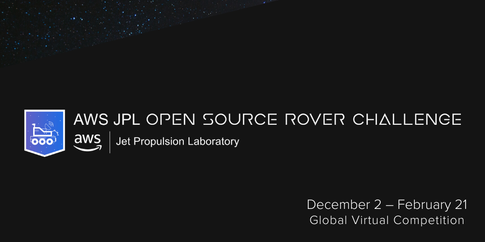
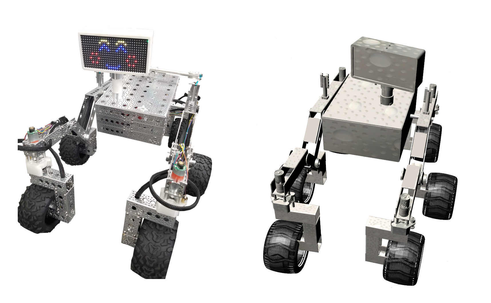
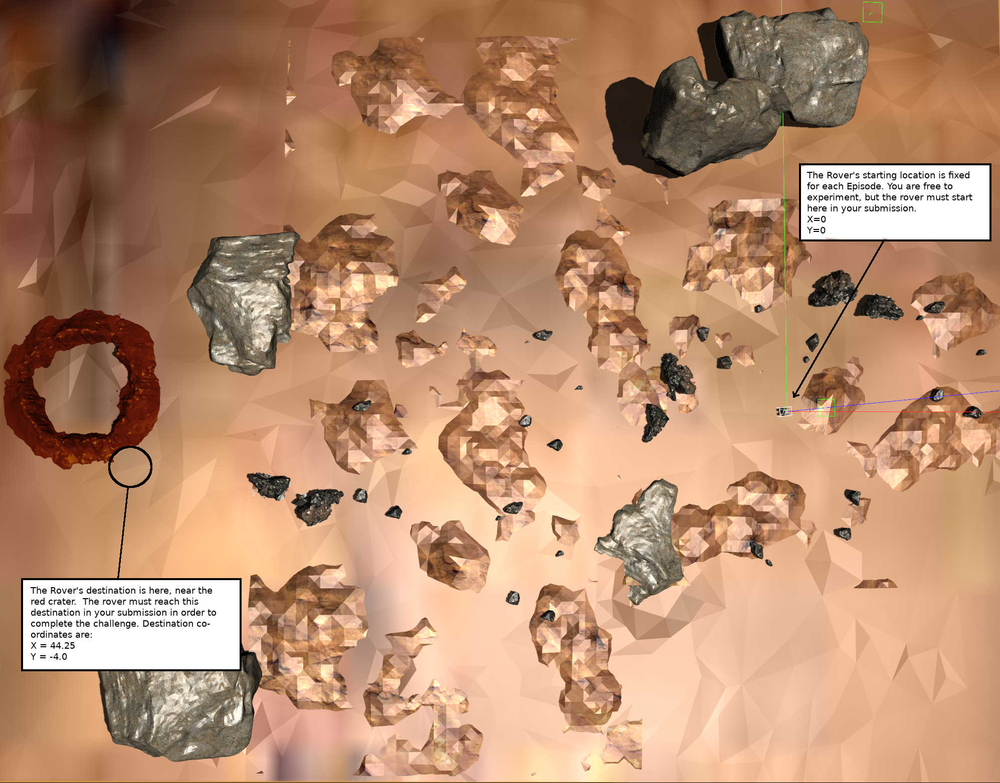
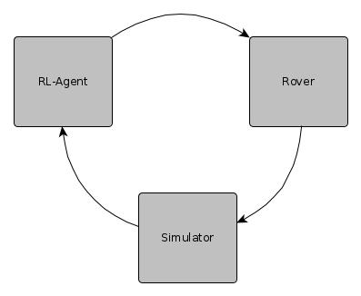
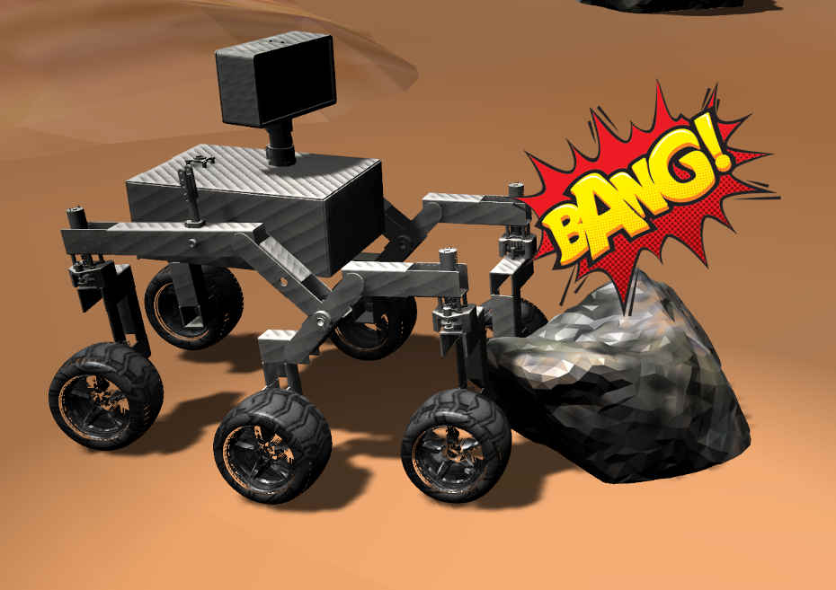

## Welcome to the AWS-JPL Open Source Rover Challenge repository.

Here you will find everything you need to begin the challenge.

The main sections of this document are:

1. [What is the challenge?](#whatis)

2. [What are the rules to the challenge](#whataretherules)

3. [Getting Started](#gettingstarted)

3. [Asset manifest and descriptions](#assetmanifest)

4. [Help and support](#help)

## <a name="whatis"> What is the Challenge?<a/>

 The AWS - JPL Open-Source Rover Challenge is an online, virtual, global competition to be held online starting on Monday, December 2, 2019 and 
ending on Friday, February 21, 2020.  Sponsored by Amazon Web Services, Inc. (“The Sponsor” or “AWS”) and is held in collaboration with JPL and AngelHack LLC (“Administrator”).

## <a name="whataretherules"> What are the rules?</a>

 Simply put - you must train an RL agent to successfully navigate the Rover to a predetermined checkpoint on Mars.

 The below images show the NASA-JPL Open Source Rover (on the left) and your digital version of the Rover on the right

 We have simplified the action space to three discrete options:

        
        Turn left
        Turn right
        Stay Straight

 We have set the Rover to use a constant, even linear acceleration, in other words, you cannot make the Rover go faster or slower at this time.
    Wall Time is not a factor in the scoring mechanism.

 The RL-agent leverages rl_coach to manage the training process.  This repo ships with a Clipped PPO algorithm but you are free to use a different algorithm

        

 To win the challenge, your RL-agent must navigate the Rover to the checkpoint and have the HIGHEST SCORE

 There is currently a single [simulated] Martian environment that all participants will use.  

 The scoring algorithm calculates a score when the Rover reaches the destination point, without collisions, in single episode

        Begin with 10,000 basis points
        Subtract the number of (time) steps required to reach the checkpoint
        Subtract the distance travelled to reach the checkpoint (in meters)
        Subtract the Rover's average linear acceleration (measured in m/s^2)
        

 The scoring mechanism is designed to reflect the highest score for the Rover that:

        Reaches the destination by means of the most optimized path (measured in time steps)
        Reaches the destination by means of the most optimized, shortest path (measured in distance traveled)
        Reaches the destination without experiencing unnecessary acceleration that could represent wheel hop or drops
    
## <a name="gettingstarted">Getting Started</a>

 While familiarity with RoS and Gazebo are not required for this challenge, they can be useful to understand how your RL-agent is controlling the Rover.
You will be required to submit your entry in the form of an AWS Robomaker simulation job.  This repo can be cloned directly into a (Cloud9) Robomaker development environment. 
It will not do a very good job training, however as the reward_function (more on that below) is empty.

All of the Martian world environment variables and Rover sensor data are captured for you and are then 
made available via global python variables.  You must populate the method known as the "reward_function()".  
The challenge ships with examples of how to populate the reward function (found in the Training Grounds Gym environment). 
However, no level of accuracy or performance is guaranteed as the code is meant to give you a learning aid, not the solution.

 If you wish to learn more about how the Rover interacts with it's environment, you can look at the "Training Grounds" world that also
ships with this repo.  It is a very basic world with monolith type structures that the Rover must learn to navigate around.  You are free
to edit this world as you wish to learn more about how the Rover manuevers. 

<b>DO NOT EDIT THE ROVER DESCRIPTION (src/rover)</b> The Rover description that ships with this repo is the "gold standard" description and it will be
the Rover used to score your entries to the competition. 

<b>DO NOT EDIT THE MARTIAN WORLD (src/mars)</b> The Martian world that ships with this repo is the "gold standard" and it is the same one that will be
used to score your entry

## <a name="assetmanifest">Asset manifest and descriptions</a>

Project Structure:
	There are three primary components of the solution:
	
	    
	    + src/rover/    A RoS package describing the Open Source Rover - this package is NOT editable
	    + src/mars/     A RoS/Gazebo package that describes and runs the simulated world
	    + src/rl-agent/ A Python3 module that contains a custom OpenAI Gym environment as well as wrapper code to initiate an rl_coach training session.  
	    within this module is a dedicated function 
	
    These three components work together to allow the Rover to navigate the Martian surface and send observation <-> reward tuples
	back to the RL-agent which then uses a TensorFlow algorithm to learn how to optimize actions.
	
	
Custom Gym Environment:
    This is gym environment exists as a single python file in src -> rl-agent -> environments -> mars_env.py
    
   mars_env.py is where you will create your reward function.  There is already a class method for you called:
    def reward_function(self)
    
   while you are free to add your own code to this method, you cannot change the signature of the method, or change the return types.
    
   the method must return a boolean value indicating if the episode has ended (see more about episode ending events below) 
   the method must also return a reward value for that time step.
    
   If you believe they are warranted, you are free to add additional global variables in the environment.  However, keep in mind
   if they are episodic values (values that should be reset after each episode) you will need to reset those values within the 
   reward_function method once you have determined the episode should end.
 
	
Recommended Episode ending scenarios:
    There are several scenarios that should automatically end an episode. To end an episode simple set the "done" variable in the reward_function method to True.
    
1. If the Rover collides with an object

    
    NOTE: If any part of the Rover other than the BOTTOM of the wheels comes into contact with a foreign object, it is considered a Collision. If an object comes into
    contact with the SIDE of the wheel, it is still considered a collision.

2. If the Rover's Power supply is drained
    This limit is currently set to 2,000 steps per episode

There are several global constants and class scoped variables in the mars_env.py to help you build your Reward Function. These are known as "Episodic values" and will reset with each
new episode.  Do not remove any of these variables.

<b>steps (integer)</b>

    The number of [time] steps associated with the current episode.  
    This is an observation-action-reward process, not distance traveled

<b>current_distance_to_checkpoint (float)</b>

    The number of meters to the checkpoint, from the Rover's current position  
	
<b>closer_to_checkpoint (bool)</b>	

    A boolean value to tell you if the Rover's last step took it closer (True) 
    or further (False) from the Checkpoint
	
<b>distance_travelled (float)</b>
 
    The total distance, in meters the Rover has traveled in the current Episode
	
<b>collision_threshold (float)</b> 
    
    The Rover is quipped with a LIDAR and will detect the distance of the closest 
    object 45 degrees to the right or left, within 4.5 meters
	
<b>last_collision_threshold (float)</b>

    the collision_threshold of the previous [time] step
	
<b>x,y (float, float)</b>

    The current coordinate location of the Rover on the [simulated] Martian surface
	
<b>last_position_x, last_position_y (float, float)</b>

    Coordinate location of the Rover in the previous time step
	
<b>reward_in_episode (integer)</b>

    The cumulative reward for the current episode. As the participant determines 
    the reward signal this number should not be compared to any other participants 
    episodic reward
	
<b>power_supply_range (integer)</b>

    This is the range of the Rover in a given episode.  It decrements by time steps, 
    NOT distance traveled in order to prevent the Rover from getting stuck or 
    if it flips due to fall/collision and cannot respond to commands
	

If you believe they are warranted, you are free to add additional global variables in the environment.  <b>However</b>, keep in mind
   these are episodic values, or values that reset after each episode. You will need to write additional code to reset those values within the 
   reward_function method once you have determined the episode should end.

## <a name="help">Help and Support</a>

slack channel:  [awsjplroverchallenge.slack.com](https://awsjplroverchallenge.slack.com/)

